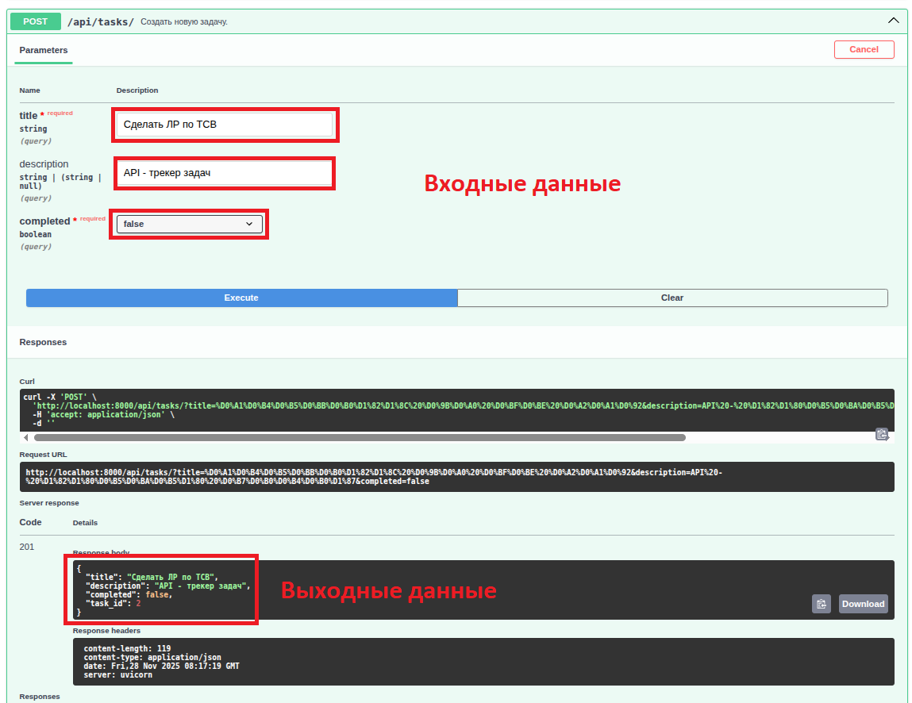
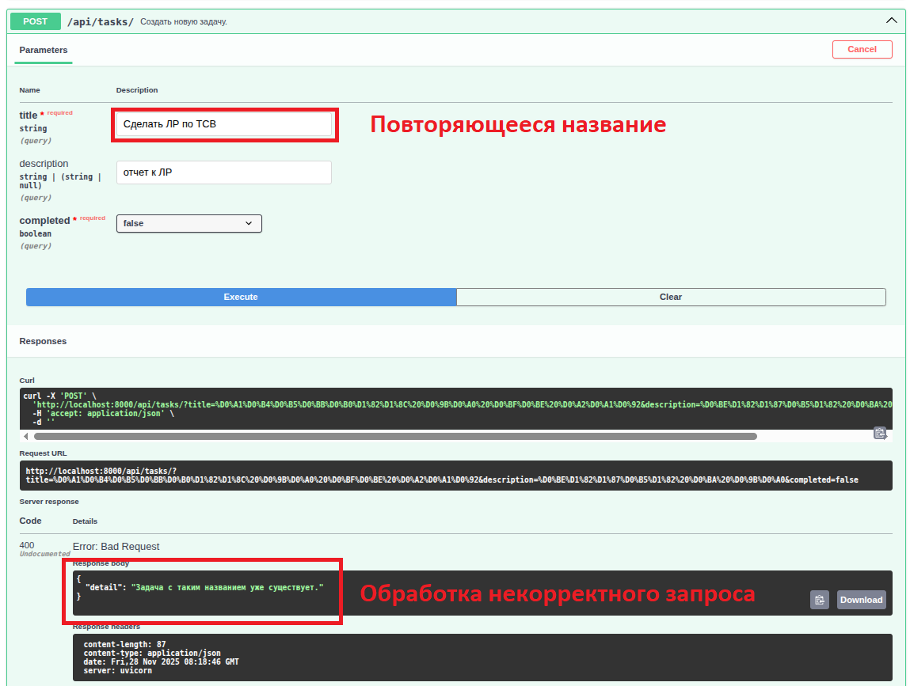
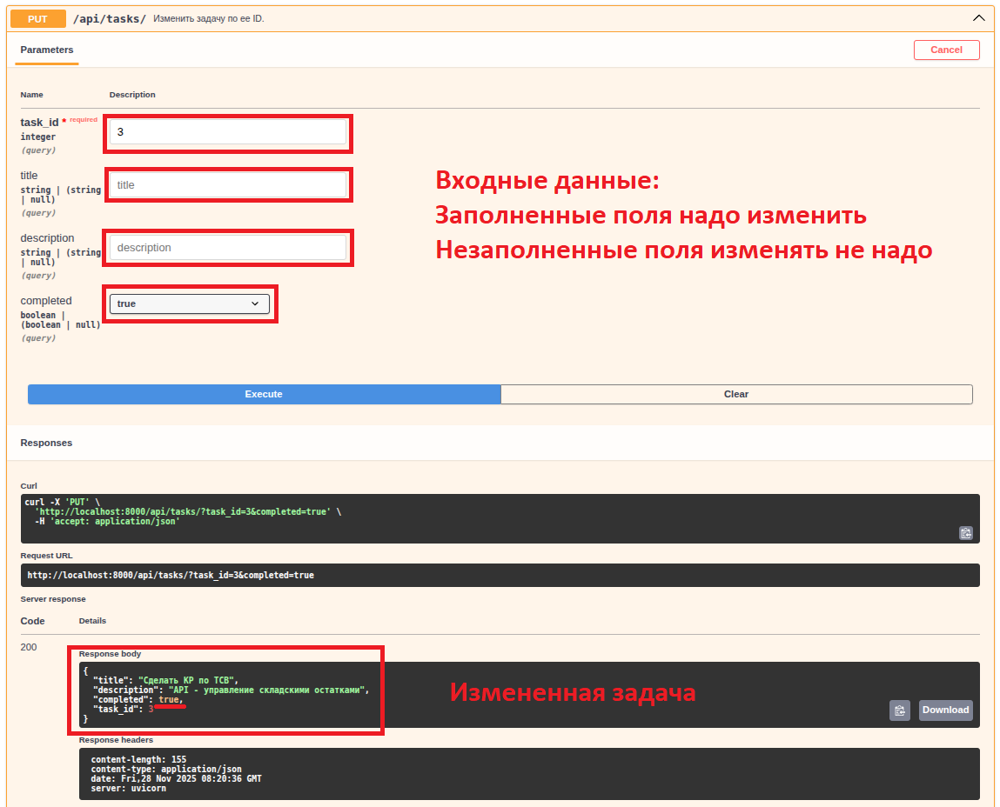
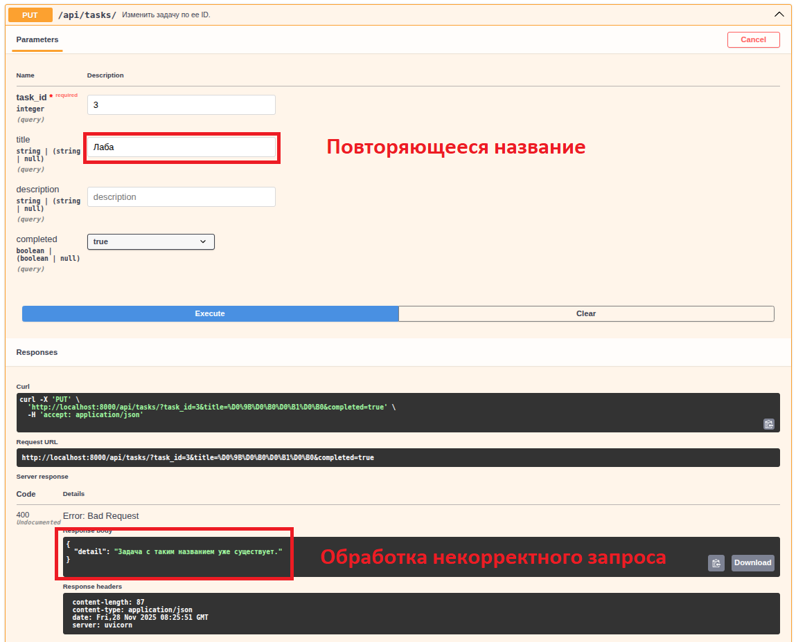
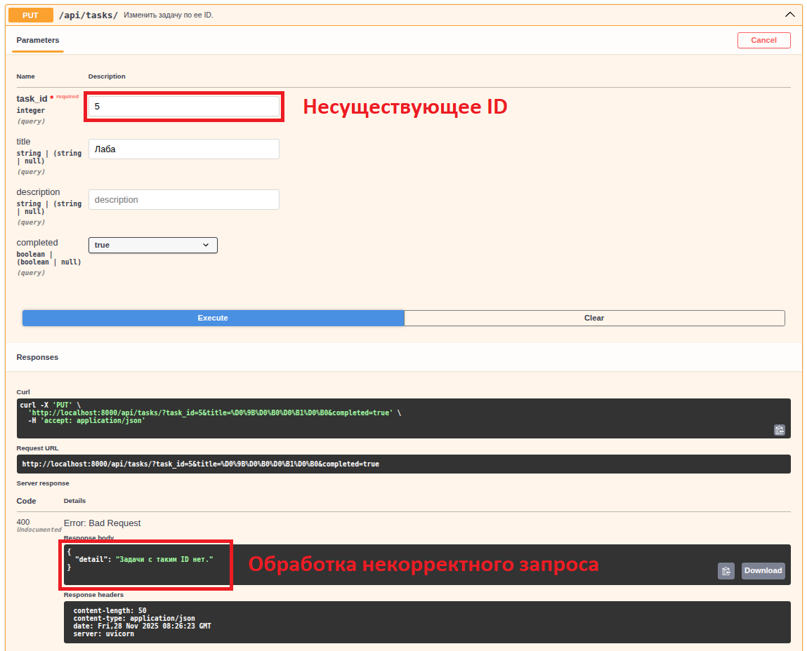
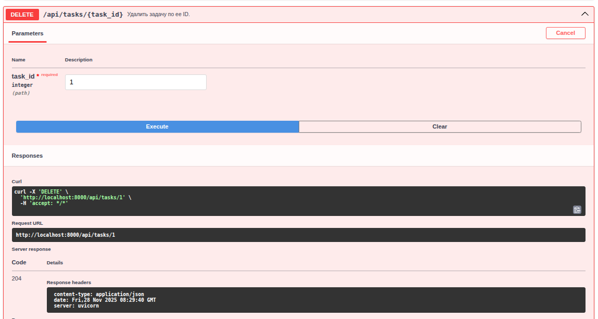
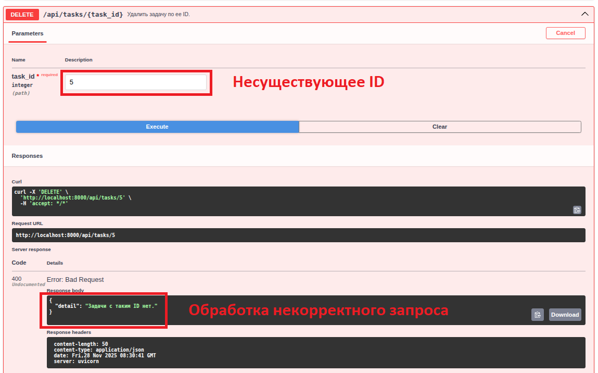
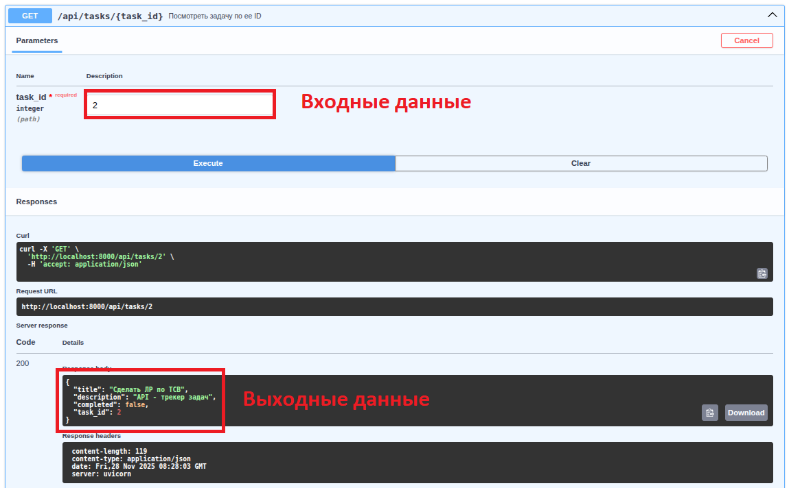
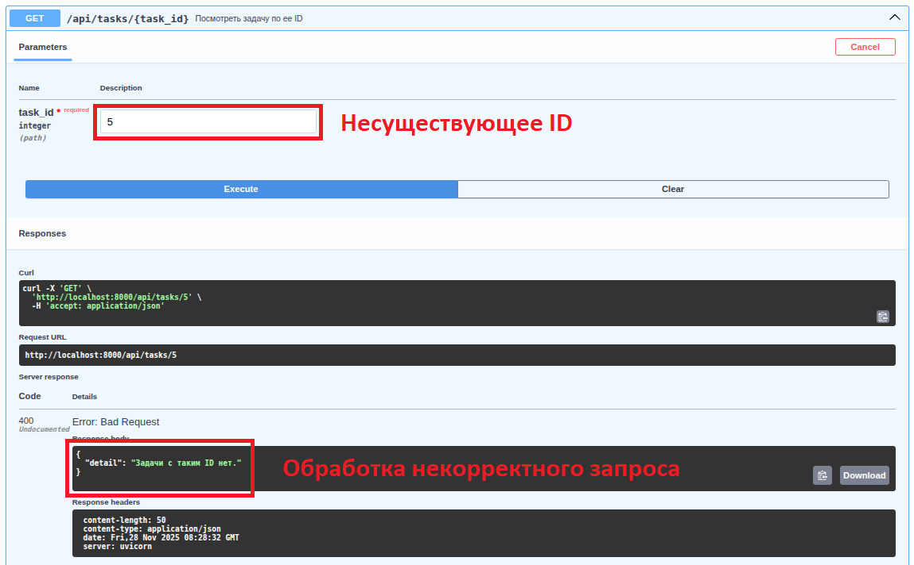
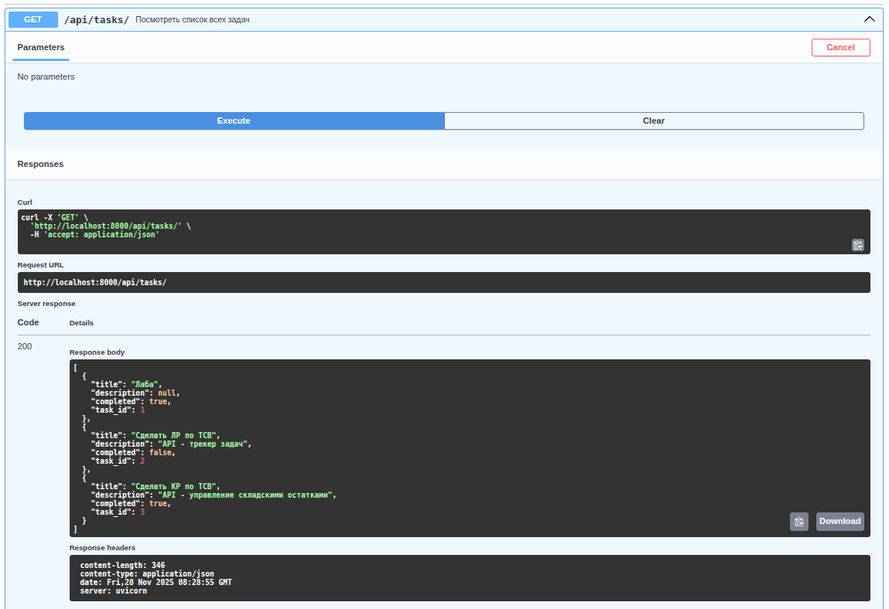

# Task Manager API

## Описание проекта

Task Manager API- Простой API для управления задачами для учебного занятия. Приложение позволяет добавлять, удалять, изменять и просматривать задачи. Приложение не имеет пользовательского интерфейса, поэтому взаимодействие с нним осуществляется через инструмент Swagger UI.

### Основные функции
1. Добавление задачи
    + корректное:  
    
    + некорректное:  
    

2. Изменение задачи   
    + корректное:  
    
    + некорректное:  
    
    

3. Удаление задачи
    + корректное:  
    
    + некорректное:  
    

4. Просмотр задачи по ID:  
    + корректное:  
    
    + некорректное:  
    

5. Просмотр всех задач:  


### Инструкция по запуску

1. Клонируйте репозиторий:
```bash
git https://github.com/AlbinaMissarova/Task_Manager.git
```
2. Запустите приложение с помощью Docker Compose (в фоновом режиме):
```bash
docker compose up --build -d
```
При первом запуске будут созданы все необходимые таблицы. 
Вся информация из базы данных будет сохраняться и отобажаться при следующих сеансах работы с приложением.

3. Документация API и его использование доступны по адресу: http://localhost:8000/docs
4. Остановка приложения 
```bash
docker compose down
```
4. Для полной очистки с удалением всей сохраненной информации:
```bash
docker compose down -v
```

## Структура репозитория и назначение файлов
### Корневая директория
Корневая директория содержит основные файлы для запуска приложения: 
* requirements.txt - зависимости Python
* Dockerfile - конфигурация Docker образа приложения
* docker-compose.yml - конфигурация Docker Compose для запуска приложения и монтирования директории с данными

### Директория src/
Директория src содержит все исходные файлы:
* main.py - основной файл приложения FastAPI
* schemas.py - Pydantic схемы для валидации данных
* database.py - настройка подключения к базе данных
* models.py - ORM модели базы данных
* crud.py - операции с базой данных 
